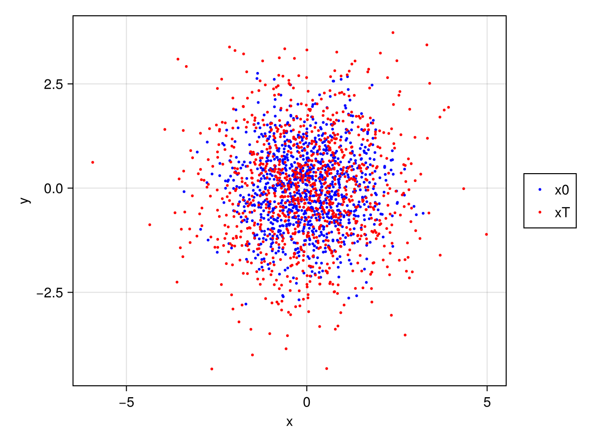
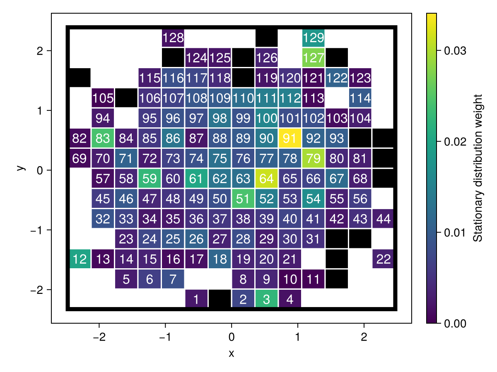

# UlamMethod.jl

[](https://70gage70.github.io/UlamMethod.jl/)


## Introduction

This package is an implementation of Ulam's method [^1] [^2] (see also Galerkin projection [^3]) for the discretization of a stochastic operator using pure Julia. Given a set of one-step trajectories 
```math
\mathbf{x}_{0, 1} \to  \mathbf{x}_{T, 1}, \mathbf{x}_{0, 2} \to  \mathbf{x}_{T, 2} \dots
```
defined in a subset of $\mathbb{R}^N$, the essential goal of Ulam's method is to partition the domain into a series of non-intersecting regions and construct a transition probability matrix $P$ on these regions.  

### Features
- Built on the [Meshes.jl](https://github.com/JuliaGeometry/Meshes.jl) computational geometry framework.
- Supports trajectory data in arbitrary dimensions.
- Supports automatic boundary construction.
- Multiple 2D algorithms for partitioning to triangles, rectangles, hexagons and adaptively sized [Voronoi cells](https://en.wikipedia.org/wiki/Voronoi_diagram).
- Multiple stochasticization algorithms.
- One-line plotting conveniences in 2D for easy visualization.

## Documentation

[Documentation](https://70gage70.github.io/UlamMethod.jl/)

## Installation

This package is in the Julia General Registry. In the Julia REPL, run the following code and follow the prompts:

```julia
import Pkg
Pkg.add("UlamMethod")
```

Access the functionality of the package in your code by including the following line:

```julia
using UlamMethod
```

## Quickstart

### Applying Ulam's method

The highest level function is 
```julia
ulam_method(traj, nbins; nirvana)
``` 
where

- `traj`: A `Trajectories` object, holding the short-range trajectory data.
- `nbins`: The number of bins requested. When using this high-level convenience function, these will be uniform segements (1D), rectangles (2D) and hypercubes (≥3D).
- `nirvana`: The boundary of the bins will be set such that the fraction of data in nirvana[^4] is equal to this value. In other words, a fraction `nirvana` of the data will be outside of the binned region.

In general, your trajectory data can be loaded simply as `traj = Trajectories(x0, xT)`, where `x0` and `xT` are `Dim x N` matrices such that `Dim` is the dimension of the data and `N` is the number of points. For testing, the function `Trajectories(Dim, N)` is provided that generates random trajectories automatically. We will generate `1000` trajectories in 2D and apply Ulam's method with `200` bins.

```julia
using UlamMethod
import Random; Random.seed!(1234) # reproducible randomness

traj = Trajectories(2, 1000)
ulam = ulam_method(traj, 200)
```

### Using the result

After computing `ulam`, use the following functions:

- `P_closed(ulam)` gives the full transition probability matrix.
-  `bins(ulam)` gives the bins and `points(bins(ulam))` gives their vertices.
- `membership(points, ulam)` returns the bin membership of a `Dim x n_points` matrix `points`. 

### Plotting

In order to use the plotting functionality, a Makie backend is required. For this example, this amounts to including the line `import CairoMakie`. This provides access to the function `viz(object; kwargs...)` which can visualize any UlamMethod object.

```julia
import CairoMakie
viz(traj)
```

[](https://70gage70.github.io/UlamMethod.jl/)

```julia
viz(ulam)
```

[](https://70gage70.github.io/UlamMethod.jl/)

Note that bins colored black are bins that contained data but were not a member of the largest strongly connected component.

## Citation

Please use the following citation if you use this package in your research.

```
@article{bonner2023improving,
  title={Improving the stability of temporal statistics in transition path theory with sparse data},
  author={Bonner, Gage and Beron-Vera, FJ and Olascoaga, MJ},
  journal={Chaos: An Interdisciplinary Journal of Nonlinear Science},
  volume={33},
  number={6},
  year={2023},
  publisher={AIP Publishing}
}
```

Initial development of this package was supported by the National Science Foundation.

## References

[^1]: Ulam, Stanislaw M. A collection of mathematical problems. No. 8. Interscience Publishers, 1960.

[^2]: Li, Tien-Yien. "Finite approximation for the Frobenius-Perron operator. A solution to Ulam's conjecture." Journal of Approximation theory 17.2 (1976): 177-186.

[^3]: Reddy, Junuthula Narasimha. Introduction to the finite element method. McGraw-Hill Education, 2019.

[^4]: In brief, nirvana is an extra state appended to an open system to close it; trajectories which point from inside the domain to the outisde of the domain transition to this nirvana state. Trajectories which point from outside the domain to the inside are transitions "from" nirvana - how exactly these data are reinjected is controlled by the `ReinjectionAlgorithm`.

